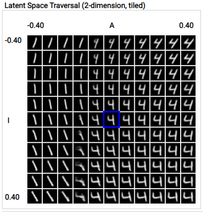

# High-Dimensional Latent Space Visualization


### Environment (Recommended)
- Frontend
  - d3.js
  - canvas-free-drawing.js [(Link)](https://github.com/federico-moretti/canvas-free-drawing)
- Backend
  - Python == 3.6.10
  - torch == 1.5.0
  - torchvision == 0.6.0
  - Pillow == 7.1.2
  - numpy == 1.18.5
  - sklearn == 0.23.1
  - argparse

### Installing & Settings
#### Backend
- Install pretrained model
```
git submodule update --init --recursive
git clone --recursive https://github.com/MKRoughdiamond/InfoVis20202.git
pip install -r backend/model/requirements.txt
```
  - Backend server setting
```
python3 server.py -host (HOST_IP) -port (PORT)
```

#### Frontend
- Fix config.js to connect backend
```
cp config_example.js config.js
vi config.js
```
  - `config.js`
```javascript
const host = '(BACKEND_IP)';
const port = '(BACKEND_PORT)';
```
- Frontend server setting
```
python3 -m http.server (FRONTEND_PORT)
```

### How to Use
#### TSNE visualization
- TSNE results with given number of data
- Hover : shows reconstructed image
- Click : get latent vector of selected point, update all


#### Tiled traversal
- 2D latent traversal on two selected dimensions
- Can choose a dimension pair, can modify values of other dimensions
- Click on image : get latent vector of selected image, update all



#### User Drawing
- Shows current reconstructed image and user can upload new data
- Data upload : user can upload a new image
- Drawing : use can draw a new image
- Send to backend : get latent vector of a new image, update all


#### Linear traversal
- 1D latent traversal on each dimension
- Click on image : get latent vector of selected image, update all


#### Parameter configuration
- Can modify several parameters
- # of tiles : change numbers of rows and columns of tiled traversal
- # of lines : change number of columns of linear traversal
- Traversal scale : change the difference between adjacent images
- Select model : change the target model


